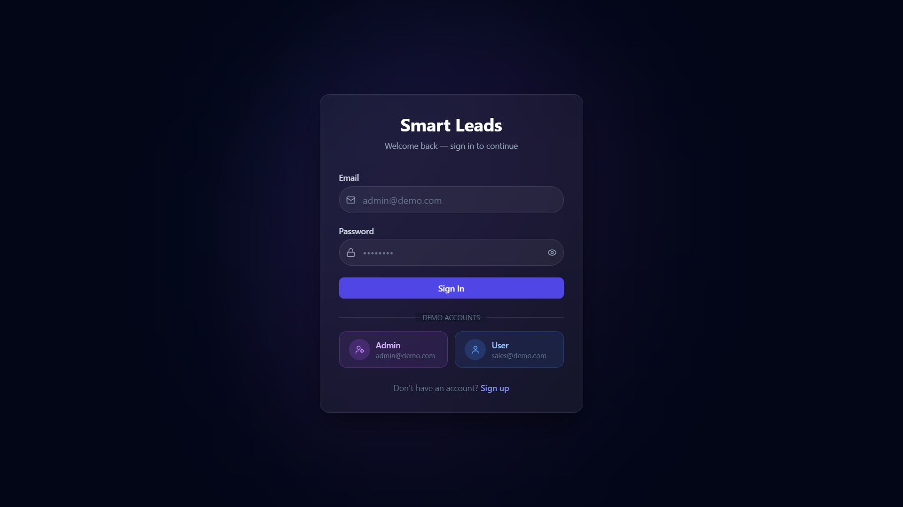
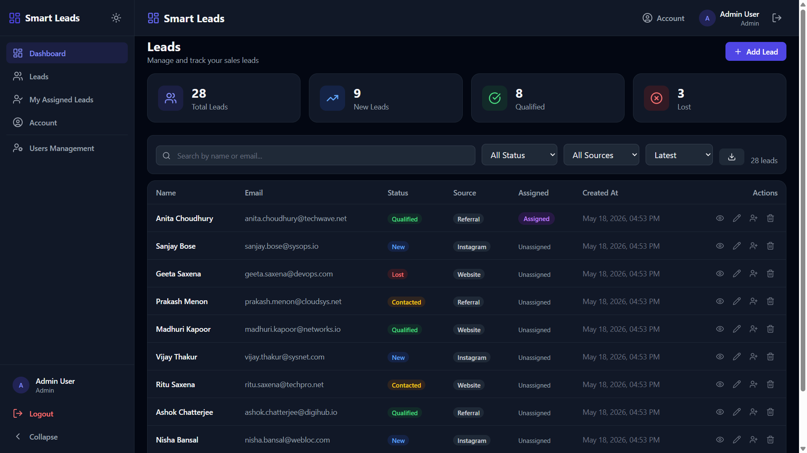
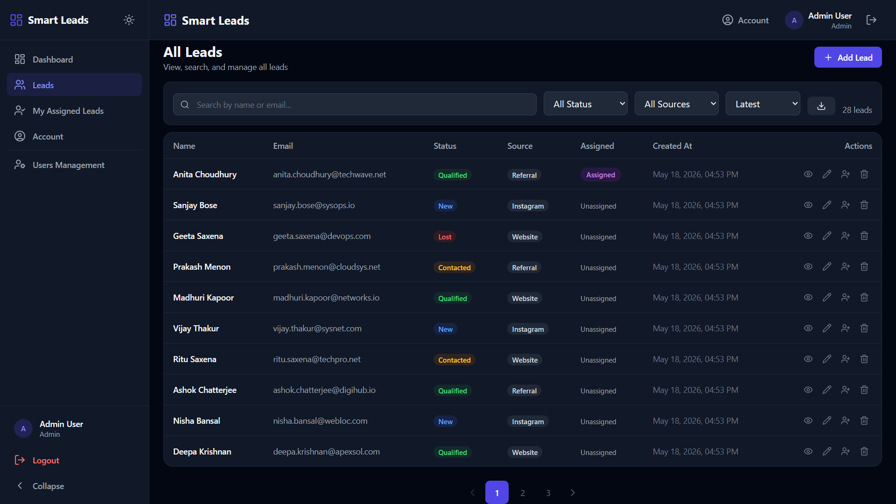
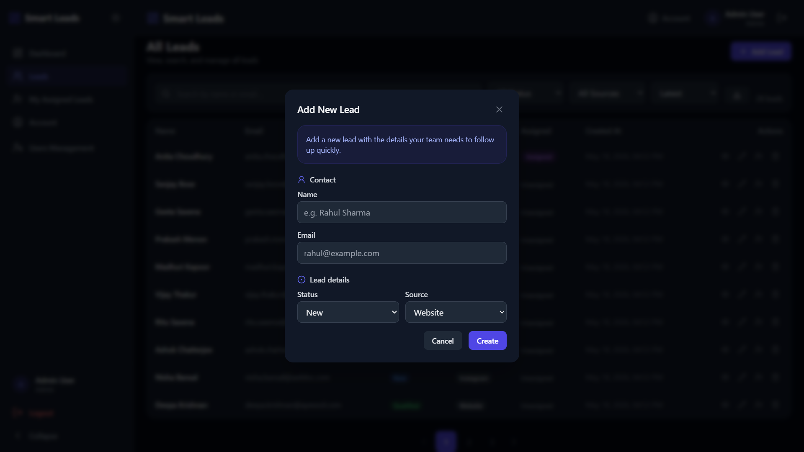
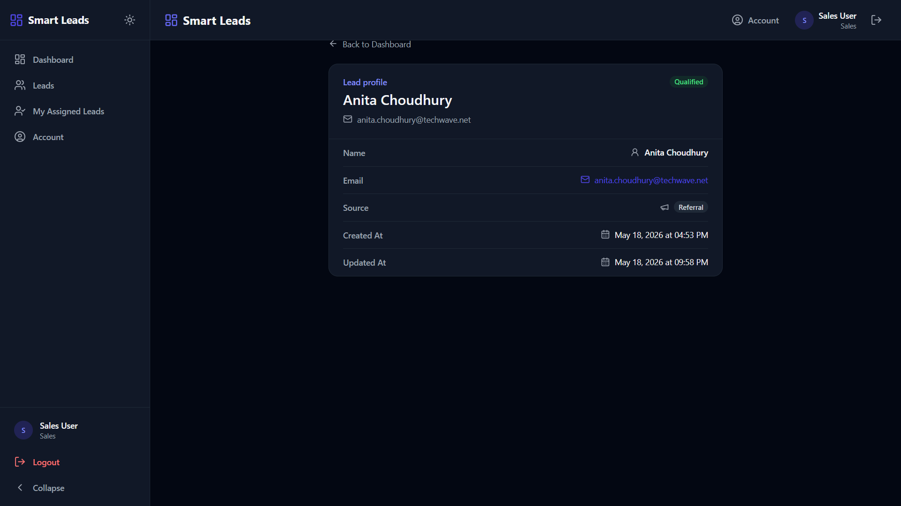
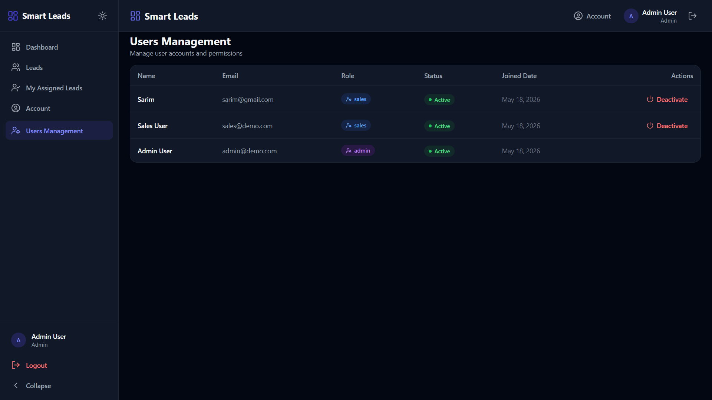
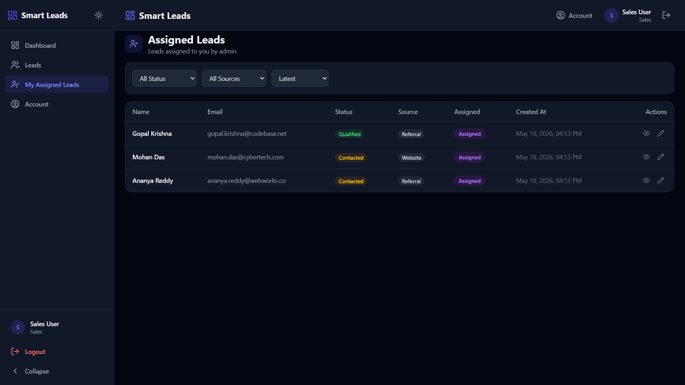
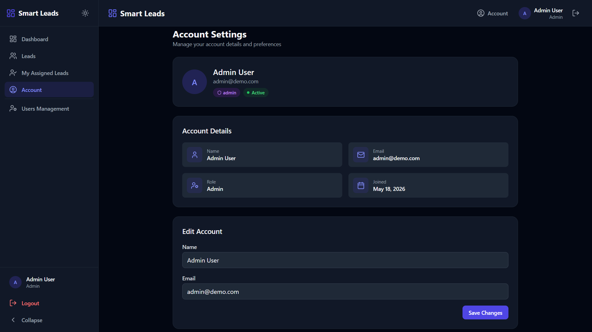

# Smart Leads Dashboard

A full-stack MERN (MongoDB, Express, React, Node.js) application for managing sales leads with role-based access control, built as a full-stack web development internship assignment.

---

## Table of Contents

1. [Project Overview](#project-overview)
2. [Features](#features)
3. [Tech Stack](#tech-stack)
4. [Role Permissions](#role-permissions)
5. [Project Structure](#project-structure)
6. [Setup Instructions](#setup-instructions)
   - [Backend Setup](#backend-setup)
   - [Frontend Setup](#frontend-setup)
   - [Docker Setup](#docker-setup)
7. [Environment Variables](#environment-variables)
8. [Test Credentials](#test-credentials)
9. [API Documentation](#api-documentation)
10. [Deployment](#deployment)
11. [Screenshots](#screenshots)
12. [Author](#author)

---

## Project Overview

**Smart Leads Dashboard** is a full-stack web application that enables sales teams to manage leads effectively. It supports user authentication, lead CRUD operations, filtering, search, pagination, CSV export, and role-based access control for Admin and Sales User roles.

---

## Features

- [x] JWT Authentication
- [x] User Registration & Login with form validation (Zod)
- [x] Password Hashing with bcrypt
- [x] Protected Routes with auth middleware
- [x] Lead CRUD (Create, Read, Update, Delete)
- [x] Lead Fields: name, email, status, source, createdAt
- [x] Status values: New, Contacted, Qualified, Lost
- [x] Source values: Website, Instagram, Referral
- [x] Advanced Filtering by status and source
- [x] Real-time Search by name or email (debounced 500ms)
- [x] Sort by latest or oldest creation date
- [x] Combined Filters (search + status + source + sort)
- [x] Backend Pagination (10 leads per page)
- [x] Pagination metadata with total page count
- [x] CSV Export (backend-streamed, filter-aware)
- [x] Role-Based Access Control (Admin / Sales User)
- [x] User Account Activation Control (isActive field)
- [x] Admin User Management (activate/deactivate users)
- [x] Account Management (view/edit profile, delete own account)
- [x] Lead Assignment (admin can assign leads to sales users)
- [x] Assigned Leads Page (sales users can view their assigned leads)
- [x] Docker Setup with docker-compose
- [x] Loading, Empty, and Error States
- [x] Form Validation on client and server
- [x] Dark Mode support

---

## Tech Stack

| Layer      | Technology                                               |
|------------|----------------------------------------------------------|
| Frontend   | React 18, TypeScript, TailwindCSS, Vite                 |
| Backend    | Node.js, Express.js, TypeScript                          |
| Database   | MongoDB 7, Mongoose ODM                                 |
| Auth       | JWT (jsonwebtoken), bcryptjs                              |
| Validation | Zod (client and server)                                  |
| State Mgmt | React Context (auth), local component state               |
| HTTP       | Axios                                                     |

---

## Role Permissions

| Feature                              | Admin | Sales User |
|--------------------------------------|:-----:|:----------:|
| View all leads                       |  ✓   |     ✓     |
| View individual lead                 |  ✓   |     ✓     |
| Create lead                          |  ✓   |     ✓     |
| Update lead                          |  ✓   |     ✓     |
| Delete lead                          |  ✓   |     ✗     |
| Export leads to CSV                  |  ✓   |     ✓     |
| View all users                       |  ✓   |     ✗     |
| Manage users (activate/deactivate)   |  ✓   |     ✗     |
| User account activation control      |  ✓   |     ✗     |
| View own profile                     |  ✓   |     ✓     |
| Edit own profile (name/email)        |  ✓   |     ✓     |
| Delete own account                   |  ✗   |     ✓     |
| Assign leads to sales users          |  ✓   |     ✗     |
| View assigned leads                  |  ✗   |     ✓     |

---

## Project Structure

```
LeadDashboard/
├── client/                          # React frontend (Vite + TypeScript)
│   ├── src/
│   │   ├── components/
│   │   │   ├── common/              # Button, Input, Select, Badge, Modal
│   │   │   ├── layout/              # Navbar, Layout
│   │   │   └── leads/               # StatsCards, LeadsTable, LeadFilters,
│   │   │                             # LeadForm, Pagination, TableSkeleton
│   │   ├── features/
│   │   │   ├── auth/                # LoginPage, RegisterPage, AuthContext
│   │   │   └── leads/               # Dashboard, LeadDetail, LeadsPage,
│   │   │                             # leads.types, leads.service
│   │   ├── hooks/                   # useDebounce, useAuth
│   │   ├── lib/                     # axios instance, error helpers
│   │   ├── pages/                   # Route pages
│   │   ├── services/                # API services (auth, leads)
│   │   ├── store/                   # Zustand auth store
│   │   ├── types/                   # TypeScript types
│   │   └── utils/                   # Validation schemas, helpers
│   ├── .env.example
│   └── package.json
│
├── server/                          # Node/Express backend
│   ├── src/
│   │   ├── config/                  # Database configuration
│   │   ├── controllers/             # Request handlers (auth, leads, user)
│   │   ├── middleware/               # Auth, validation, error middleware
│   │   ├── models/                   # Mongoose schemas (User, Lead)
│   │   ├── routes/                  # Express routers
│   │   ├── services/                # Business logic (auth, leads)
│   │   ├── types/                   # Shared TypeScript types
│   │   ├── utils/                   # Response helpers
│   │   ├── seed.ts                  # Database seeder (demo data)
│   │   └── index.ts                 # App entry point
│   ├── .env.example
│   └── package.json
│
├── docker-compose.yml               # Docker orchestration
├── Dockerfile                      # Multi-stage Docker build
└── package.json                    # Root scripts (concurrently)
```

---

## Setup Instructions

### Prerequisites

- [Node.js 20+](https://nodejs.org/)
- [MongoDB 7+](https://www.mongodb.com/) (local or Atlas)
- [Docker & Docker Compose](https://www.docker.com/) (optional)

---

### Backend Setup

```bash
# Navigate to server directory
cd server

# Install dependencies
npm install

# Copy environment variables
cp .env.example .env

# Update .env with your MongoDB URI and JWT_SECRET

# Seed demo data (creates test users and leads)
npm run seed

# Start development server
npm run dev
```

Server runs at **http://localhost:5000**

---

### Frontend Setup

```bash
# Open a new terminal

# Navigate to client directory
cd client

# Install dependencies
npm install

# Copy environment variables
cp .env.example .env

# Start development server
npm run dev
```

Client runs at **http://localhost:5173**

---

### Docker Setup

```bash
# From the project root directory

# Build and start all services (MongoDB + Backend + Frontend)
docker-compose up -d

# View logs
docker-compose logs -f

# Stop services
docker-compose down

# Stop and remove volumes (clean slate)
docker-compose down -v
```

After Docker setup, the app is accessible at **http://localhost:3000**

---

## Environment Variables

### Server (`server/.env`)

| Variable        | Description                         | Default                              |
|-----------------|-------------------------------------|--------------------------------------|
| `NODE_ENV`      | Environment mode                    | `development`                        |
| `PORT`          | Server port                         | `5000`                               |
| `MONGO_URI`     | MongoDB connection string           | `mongodb://localhost:27017/leaddashboard` |
| `JWT_SECRET`    | JWT signing secret (change this!)   | `your-super-secret-jwt-key-change-in-production` |
| `JWT_EXPIRES_IN`| Token expiry duration               | `7d`                                 |

### Client (`client/.env`)

| Variable        | Description                | Default                    |
|-----------------|---------------------------|----------------------------|
| `VITE_API_URL`  | Optional API base URL for custom deployments | `/api` |

---

## Test Credentials

After running the database seeder (`npm run seed` in the server directory), the following demo accounts are available:

| Role       | Email             | Password   | Permissions              |
|------------|-------------------|------------|--------------------------|
| **Admin**  | admin@demo.com    | admin123   | Full access + user mgmt  |
| **Sales**  | sales@demo.com    | sales123   | Lead CRUD + export only  |

---

## API Documentation

The API follows RESTful conventions with a consistent JSON response format.

**Base URL:** `http://localhost:5000/api`

**Standard Response Format:**
```json
{
  "success": true,
  "data": [...],
  "meta": {
    "total": 100,
    "page": 1,
    "limit": 10,
    "totalPages": 10
  }
}
```

**Authentication Endpoints:**

| Method | Endpoint         | Description                  | Auth Required |
|--------|------------------|------------------------------|---------------|
| POST   | `/auth/register` | Register new user            | No            |
| POST   | `/auth/login`    | Login and get JWT token      | No            |
| GET    | `/auth/me`       | Get current user profile     | Yes           |
| GET    | `/auth/users`    | Get all users (list)         | Admin         |

**Lead Endpoints:**

| Method | Endpoint          | Description                   | Auth Required |
|--------|-------------------|-------------------------------|---------------|
| GET    | `/leads`           | Get paginated leads (filterable) | Yes         |
| POST   | `/leads`           | Create new lead               | Yes           |
| GET    | `/leads/:id`       | Get single lead by ID          | Yes           |
| PUT    | `/leads/:id`       | Update lead                    | Yes           |
| DELETE | `/leads/:id`       | Delete lead                    | Admin         |
| GET    | `/leads/export/csv`| Export leads as CSV            | Yes           |

**Query Parameters for `/leads`:**

| Parameter  | Values                              | Description              |
|------------|-------------------------------------|--------------------------|
| `page`     | `1`, `2`, `3`...                    | Page number              |
| `limit`    | `10`, `20`, `50`                    | Items per page           |
| `search`   | `john`, `email`...                  | Search by name or email  |
| `status`   | `New`, `Contacted`, `Qualified`, `Lost` | Filter by status     |
| `source`   | `Website`, `Instagram`, `Referral` | Filter by source         |
| `sort`     | `latest`, `oldest`                 | Sort by creation date    |

---

## Deployment

### Live URLs

- **Frontend:** https://lead-dashboard-three-sigma.vercel.app
- **Backend:** https://smart-leads-dashboard-h2ma.onrender.com
- **Database:** MongoDB Atlas (Cloud)

### Deployment Targets

| Service      | Platform  | URL                              |
|--------------|-----------|----------------------------------|
| Frontend     | Vercel    | https://lead-dashboard-client.vercel.app |
| Backend      | Render    | https://lead-dashboard-server-2.onrender.com |
| Database     | MongoDB Atlas | Cloud cluster                  |

### Deployment Steps

#### Backend (Render)

1. Push code to GitHub
2. Connect GitHub repo to Render
3. Set root directory to `server`
4. Build command: `npm install`
5. Start command: `npm start` (or `npm run start:prod`)
6. Add environment variables:
   - `NODE_ENV=production`
   - `PORT=10000`
   - `MONGO_URI=your-mongodb-atlas-connection-string`
   - `JWT_SECRET=your-secret-key`
   - `JWT_EXPIRES_IN=7d`

#### Frontend (Vercel)

1. Connect GitHub repo to Vercel
2. Set root directory to `client`
3. Build command: `npm run build`
4. Output directory: `dist`
5. Add environment variables:
   - `VITE_API_URL=https://lead-dashboard-server-2.onrender.com`

#### Database (MongoDB Atlas)

1. Create a free cluster on MongoDB Atlas
2. Create a database user with read/write permissions
3. Get the connection string (replace password)
4. Add the connection string to Render environment variables

---

## Screenshots

### Login Page


### Dashboard


### Lead Table


### Leads Form


### Lead Detail


### Admin - Users Management


### Assigned Leads (Sales User)


### Account Settings


---

## Author

**Name:** Md Sarim Abdullah<br>
**Email:** abdullah1sarim1100@gmail.com<br>
**GitHub:** https://github.com/Abdullah-Sarim<br>
**LinkedIn:** https://www.linkedin.com/in/md-sarim-abdullah-ab9435292/<br>
**Portfolio:** https://abdullahsarim.vercel.app<br>

---

*This project was built as a full-stack web development internship assignment.*